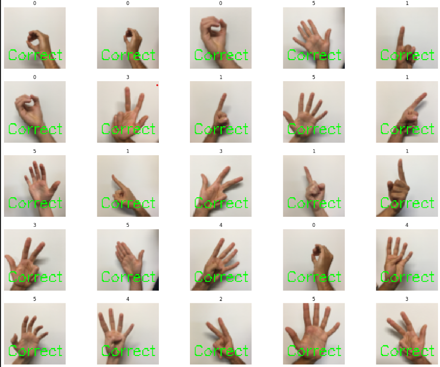

# Hand Sign Classification using Deep Learning



## Overview

In this project, two deep learning models were implemented and trained using TensorFlow. The first model was a simple manually implemented neural network, and two different optimizers were compared. The results were comparable with a significant difference.

The second model was a convolutional neural network (CNN) that significantly improved the classification performance. The difference between the performance of the simple network and the CNN was evident, showcasing the power of deep learning in hand sign recognition.

Real-time prediction using a webcam is also available in the repository.

## Dataset

The dataset used in this project consists of images of hand signs representing numbers from 0 to 5. The dataset is stored in h5py files and contains both training and test sets. Each image is a 64x64 RGB image.

## Prerequisites

To run this project, you will need the following dependencies:

- TensorFlow
- h5py
- numpy
- matplotlib
- OpenCV (cv2)

You can install these dependencies using the provided `requirements.txt` file:

```
pip install -r requirements.txt
```

## Project Structure

The repository contains the following files and directories:

1. `hand_sign_classification.ipynb`: Jupyter Notebook containing the Python code for the project. It includes the data loading, preprocessing, model definitions, training, and real-time classification using the webcam.

2. `train_signs.h5` and `test_signs.h5`: h5py files containing the training and test datasets.

3. `hand_sign_classification.png`: An image illustrating the hand sign classification project.

4. `README.md`: This file providing an overview of the project and its contents.

## How to Use

1. Clone the repository to your local machine:

```
git clone https://github.com/aliejabbari/hand-sign-classification.git
cd hand-sign-classification
```

2. Install the required dependencies:

```
pip install -r requirements.txt
```

3. Open and run the `hand_sign_classification.ipynb` notebook using Jupyter Notebook or Jupyter Lab.

4. Follow the instructions in the notebook to load the dataset, preprocess the images, build and train the neural network and CNN models, and perform real-time classification using your webcam.

## Results

The notebook includes visualization of the training process, such as loss and accuracy plots, and displays the test samples with their predicted class labels. The accuracy of the trained models on the test dataset is also provided.


## Contributing

Contributions are welcome! If you find any issues or have suggestions for improvements, feel free to open an issue or create a pull request.

## Contact

For any inquiries or questions, please contact [alijabbari.contact@gmail.com](alijabbari.contact@gmail.com).

---
